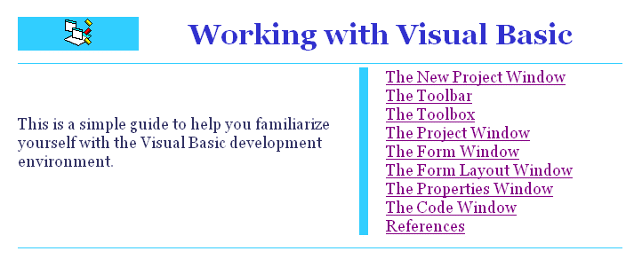



## Working with the Visual Basic IDE

### Description

This is a guide to help total beginners familiarize themselves with the Visual Basic development environment.
 
### More Info
 

             |
---                |---
**Submitted On**   |1999-03-22 07:53:00
**By**             |[Rde](https://github.com/Planet-Source-Code/PSCIndex/blob/master/ByAuthor/rde.md)
**Level**          |Beginner
**User Rating**    |4.3 (13 globes from 3 users)
**Compatibility**  |VB 5\.0, VB 6\.0
**Category**       |[Miscellaneous](https://github.com/Planet-Source-Code/PSCIndex/blob/master/ByCategory/miscellaneous__1-1.md)
**World**          |[Visual Basic](https://github.com/Planet-Source-Code/PSCIndex/blob/master/ByWorld/visual-basic.md)
**Archive File**   |[Working\_wi2158417252009\.zip](https://github.com/Planet-Source-Code/rde-working-with-the-visual-basic-ide__1-72303/archive/master.zip)

